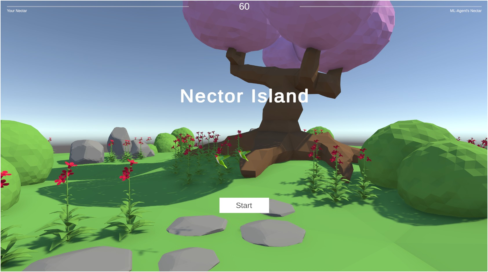
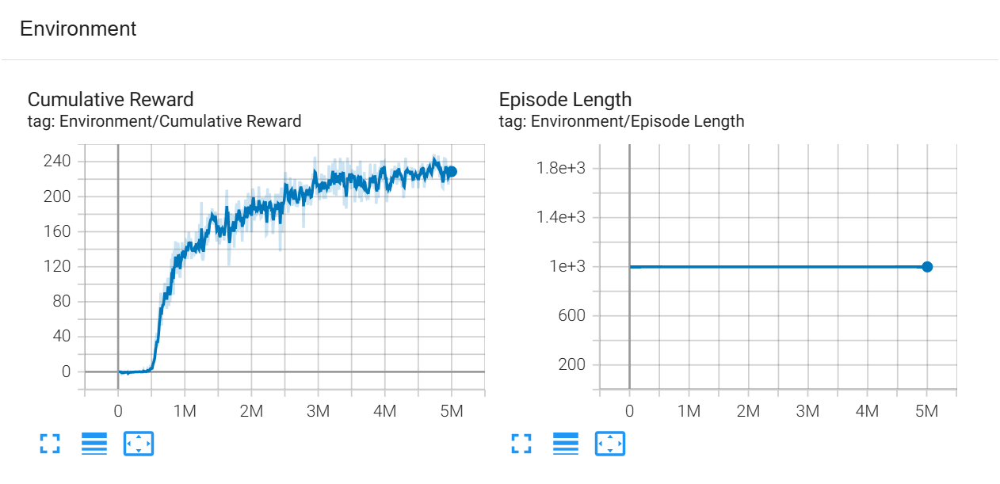
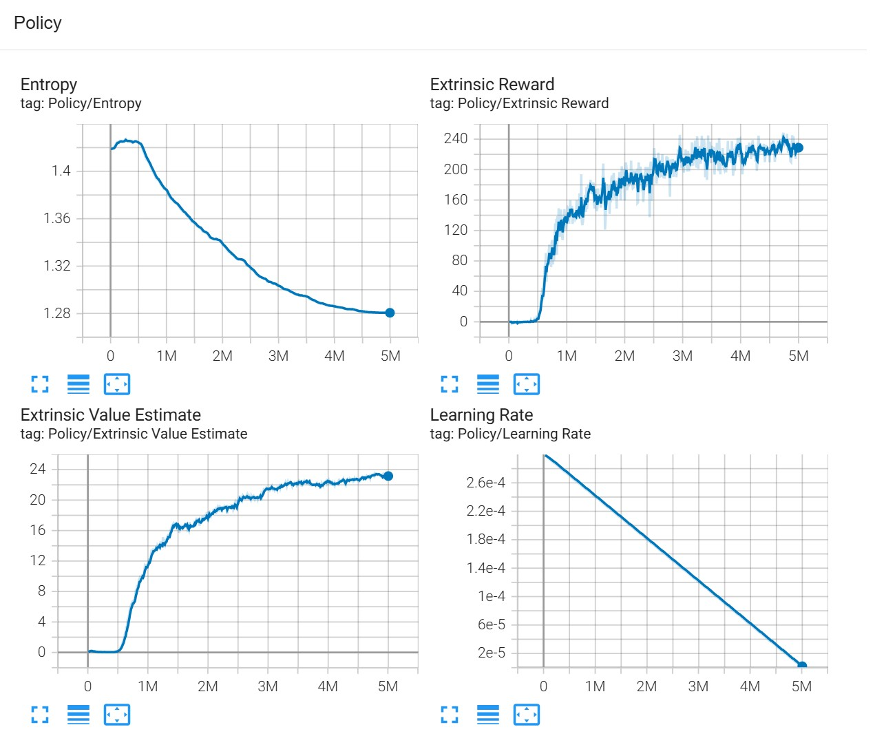
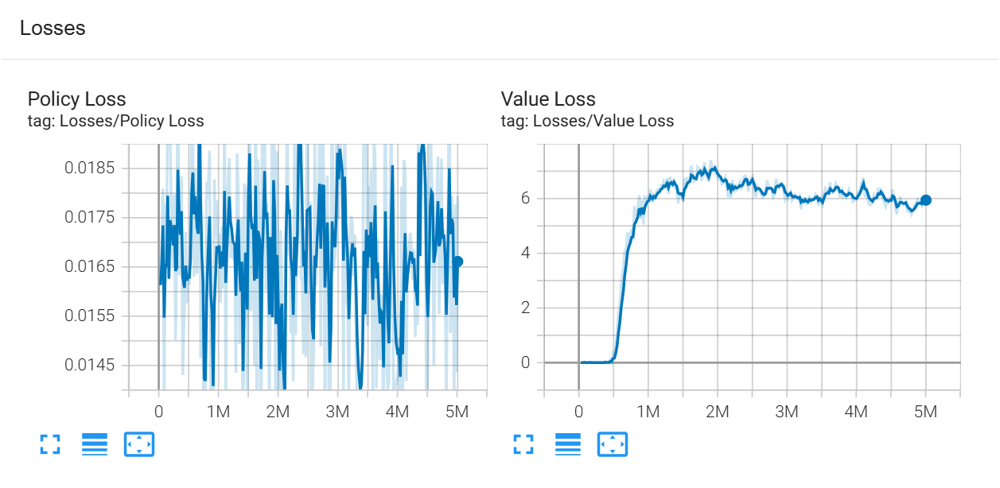

# 🧠 Intelligent Hummingbirds with Unity ML-Agents
Design and Implementation of Intelligent Agent Virtual Bird Based on Machine Learning. A Simple Game Using Unity ML-Agents.



Reinforcement Learning (RL) is among the most fascinating branches of Artificial Intelligence, and Unity ML-Agents offers an intuitive and engaging way to dive in.  
This project demonstrates the creation of intelligent, six-degrees-of-freedom hummingbirds capable of dynamically flying, locating flowers, and drinking nectar using AI.

These hummingbirds move freely in all directions, and their complex flight behaviors go beyond traditional pathfinding algorithms. To solve this challenge, we build a custom training environment and train neural networks. Players can then test their reflexes and strategy in a mini-game against these smart birds.

---

## 🧠 Neural Network Training

### 🔧 Setup Instructions

1. In Unity, select the `Hummingbird` GameObject.
2. Under the `Behavior Parameters` component, set the `Behavior Type` to `Default`.

### 🚀 Start Training

Run the following command to initiate training:

```bash
mlagents-learn ./config/trainer_config.yaml --run-id hb_02
```

### 📈 Monitor Progress

To visualize training progress with TensorBoard, use:

```bash
tensorboard --logdir results
```

### 📦 Using the Trained Model

After training is completed:

- Retrieve the `Hummingbird.nn` file from the folder named after the `--run-id`.
- Assign this file to the `Model` field in the `Behavior Parameters` of the AI Hummingbird.
- Set the trained AI agent’s `Behavior Type` to `Inference`.
- For the player-controlled hummingbird, use `Heuristic Only`.

---

## 📊 Example Training Output

**Cumulative Reward Progression:**  


**Trained Policy Visualization:**  


**Policy & Value Loses:**  


---

## 🎮 Compete Against the Trained Agent

<p align="center">
   
</p>

Control your hummingbird and go head-to-head against the trained AI in a flower-collecting mini-game.

### ⌨️ Keyboard Controls

| Movement     | Key      | Orientation   | Key      |
|--------------|----------|---------------|----------|
| Forward      | `W`      | Pitch Up      | `↑`      |
| Backward     | `S`      | Pitch Down    | `↓`      |
| Left         | `A`      | Turn Left     | `←`      |
| Right        | `D`      | Turn Right    | `→`      |
| Ascend       | `E`      |               |          |
| Descend      | `C`      |               |          |

---

## 🙏 Acknowledgements

This project is inspired by the Unity Learn course “ML-Agents: Hummingbirds,” created by **Adam Kelly** of Immersive Limit. Adam has been contributing to ML-Agents education and tutorials since 2018, helping developers build smart agents in Unity.

---
